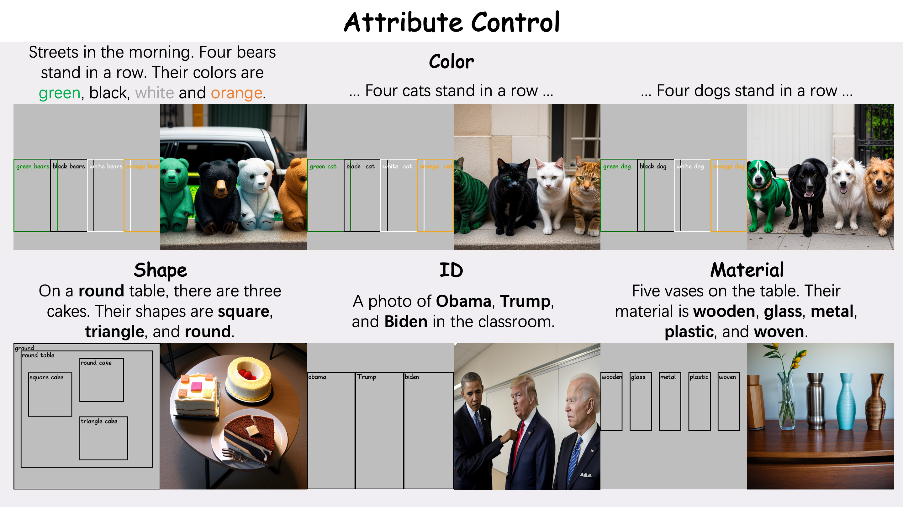
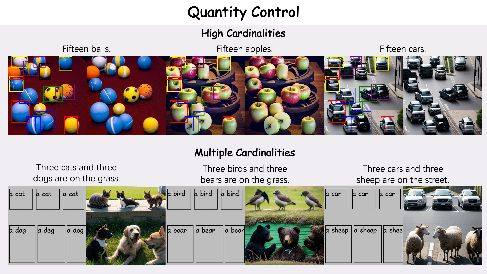
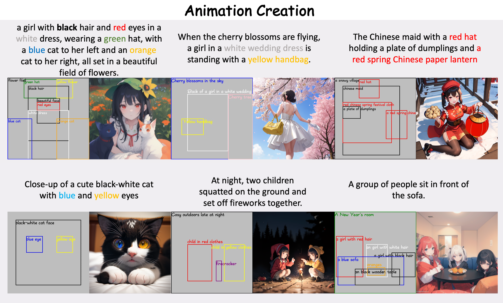
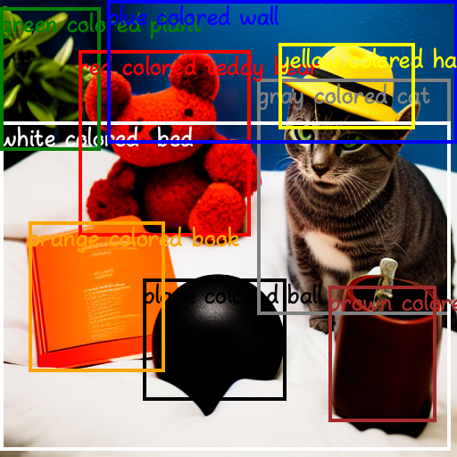
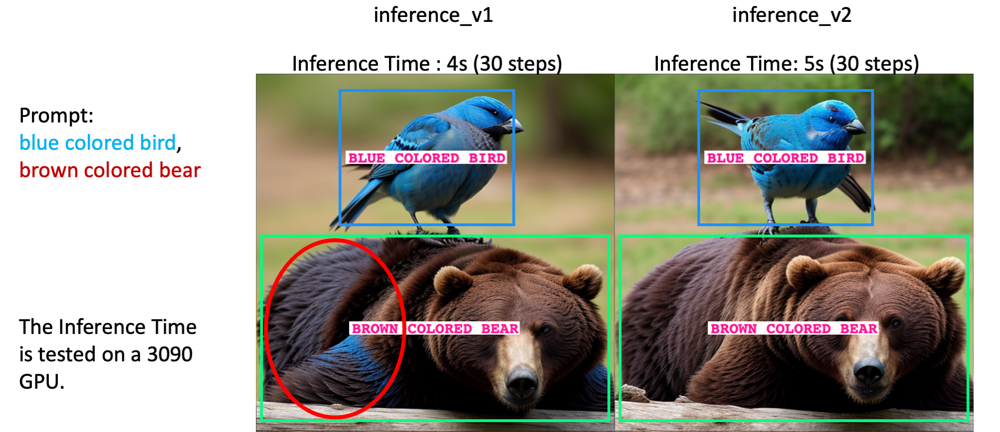
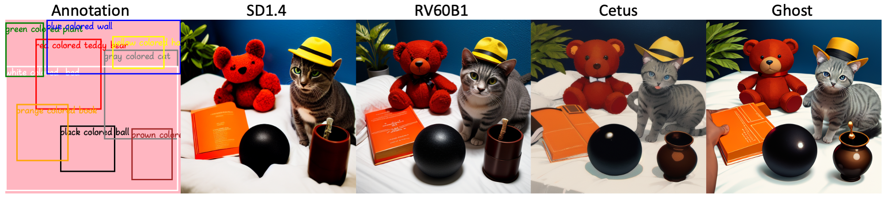
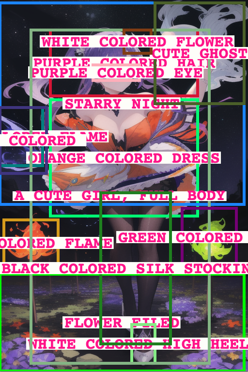
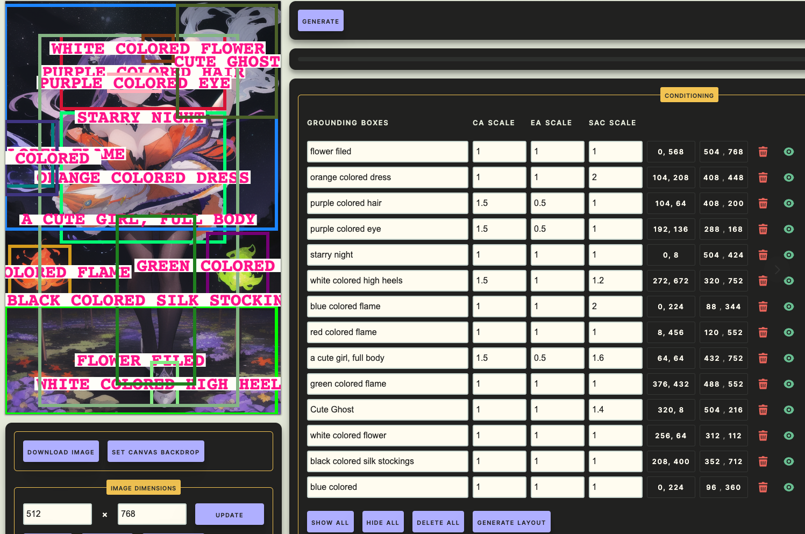

[](https://paperswithcode.com/sota/conditional-text-to-image-synthesis-on-coco-1?p=migc-multi-instance-generation-controller-for)
# [CVPR2024] MIGC: Multi-Instance Generation Controller for Text-to-Image Synthesis
### [[Paper]](https://arxiv.org/pdf/2402.05408.pdf)     [[Project Page]](https://migcproject.github.io/)
**MIGC: Multi-Instance Generation Controller for Text-to-Image Synthesis**
<br>_Dewei Zhou, You Li, Fan Ma, Xiaoting Zhang, Yi Yang_<br>
## To Do List
- [x] Project Page
- [x] Code
- [x] COCO-MIG Benchmark
- [x] Pretrained Weights on SD1.4
- [ ] WebUI
- [ ] Pretrained Weights on SDXL
<a id="Gallery"></a>
## Gallery





## Installation

### Conda environment setup
```
conda create -n MIGC_diffusers python=3.9 -y
conda activate MIGC_diffusers
pip install -r requirement.txt
pip install -e .
```
### Checkpoints
Download the [MIGC_SD14.ckpt (219M)](https://drive.google.com/file/d/1v5ik-94qlfKuCx-Cv1EfEkxNBygtsz0T/view?usp=sharing) and put it under the 'pretrained_weights' folder.
```
├── pretrained_weights
│   ├── MIGC_SD14.ckpt
├── migc
│   ├── ...
├── bench_file
│   ├── ...
```

## Single Image Generation
By using the following command, you can quickly generate an image with MIGC.
```
CUDA_VISIBLE_DEVICES=0 python inference_single_image.py
```
The following is an example of the generated image based on stable diffusion v1.4.
 
<p align="center">
  
  
</p>

🚀 **Enhanced Attribute Control**: For those seeking finer control over attribute management, consider exploring the `python inferencev2_single_image.py` script. This advanced version, `InferenceV2`, offers a significant improvement in mitigating attribute leakage issues. By accepting a slight increase in inference time, it enhances the Instance Success Ratio from 66% to an impressive 68% on COCO-MIG Benchmark. It is worth mentioning that increasing the `NaiveFuserSteps` in `inferencev2_single_image.py` can also gain stronger attribute control.

<p align="center">
  
</p>

💡 **Versatile Image Generation**: MIGC stands out as a plug-and-play controller, enabling the creation of images with unparalleled variety and quality. By simply swapping out different base generator weights, you can achieve results akin to those showcased in our [Gallery](#Gallery). For instance:

- 🌆 **[RV60B1](https://civitai.com/models/4201/realistic-vision-v60-b1)**: Ideal for those seeking lifelike detail, RV60B1 specializes in generating images with stunning realism.
- 🎨 **[Cetus-Mix](https://civitai.com/models/6755/cetus-mix)** and **[Ghost](https://civitai.com/models/36520/ghostmix)**: These robust base models excel in crafting animated content.
<p align="center">
  
</p>


## COCO-MIG Bench

To validate the model's performance in position and attribute control, we designed the [COCO-MIG](https://github.com/LeyRio/MIG_Bench) benchmark for evaluation and validation.

By using the following command, you can quickly run inference on our method on the COCO-MIG bench:
```
CUDA_VISIBLE_DEVICES=0 python inference_mig_benchmark.py
```
We sampled [800 images](https://drive.google.com/drive/folders/1UyhNpZ099OTPy5ILho2cmWkiOH2j-FrB?usp=sharing) and compared MIGC with InstanceDiffusion, GLIGEN, etc. On COCO-MIG Benchmark, the results are shown below.

<table style="text-align: center;">
  <thead>
    <tr>
      <th rowspan="2" style="text-align: center;">Method</th>
      <th colspan="6" style="text-align: center;">MIOU↑</th>
      <th colspan="6" style="text-align: center;">Instance Success Rate↑</th>
	  <th rowspan="2" style="text-align: center;">Model Type</th>
    <th rowspan="2" style="text-align: center;">Publication</th>
    </tr>
	<tr>
      <th>L2</th>
      <th>L3</th>
      <th>L4</th>
      <th>L5</th>
      <th>L6</th>
      <th>Avg</th>
	  <th>L2</th>
      <th>L3</th>
      <th>L4</th>
      <th>L5</th>
      <th>L6</th>
      <th>Avg</th>
    </tr>
  </thead>
  <tbody>
	<tr>
      <td><a href="https://github.com/showlab/BoxDiff">Box-Diffusion</a></td>
      <td>0.37</td>
      <td>0.33</td>
      <td>0.25</td>
      <td>0.23</td>
      <td>0.23</td>
      <td>0.26</td>
	  <td>0.28</td>
      <td>0.24</td>
      <td>0.14</td>
      <td>0.12</td>
      <td>0.13</td>
      <td>0.16</td>
	  <td>Training-free</td>
    <td>ICCV2023</td>
    </tr>
	<tr>
      <td><a href="https://github.com/gligen/GLIGEN">Gligen</a></td>
      <td>0.37</td>
      <td>0.29</td>
      <td>0.253</td>
      <td>0.26</td>
      <td>0.26</td>
      <td>0.27</td>
	<td>0.42</td>
      <td>0.32</td>
      <td>0.27</td>
      <td>0.27</td>
      <td>0.28</td>
      <td>0.30</td>
	  <td>Adapter</td>
    <td>CVPR2023</td>
    </tr>
	<tr>
      <td><a href="https://github.com/microsoft/ReCo">ReCo</a></td>
      <td>0.55</td>
      <td>0.48</td>
      <td>0.49</td>
      <td>0.47</td>
      <td>0.49</td>
      <td>0.49</td>
	  <td>0.63</td>
      <td>0.53</td>
      <td>0.55</td>
      <td>0.52</td>
      <td>0.55</td>
      <td>0.55</td>
	  <td>Full model tuning</td>
    <td>CVPR2023</td>
    </tr>
	<tr>
      <td><a href="https://github.com/frank-xwang/InstanceDiffusion">InstanceDiffusion</a></td>
      <td>0.52</td>
      <td>0.48</td>
      <td>0.50</td>
      <td>0.42</td>
      <td>0.42</td>
      <td>0.46</td>
	  <td>0.58</td>
      <td>0.52</td>
      <td>0.55</td>
      <td>0.47</td>
      <td>0.47</td>
      <td>0.51</td>
	  <td>Adapter</td>
    <td>CVPR2024</td>
    </tr>
	<tr>
      <td><a href="https://github.com/limuloo/MIGC">Ours</a></td>
      <td><b>0.64</b></td>
      <td><b>0.58</b></td>
      <td><b>0.57</b></td>
      <td><b>0.54</b></td>
      <td><b>0.57</b></td>
      <td><b>0.56</b></td>
	  <td><b>0.74</b></td>
      <td><b>0.67</b></td>
      <td><b>0.67</b></td>
      <td><b>0.63</b></td>
      <td><b>0.66</b></td>
      <td><b>0.66</b></td>
	  <td>Adapter</td>
    <td>CVPR2024</td>
    </tr>
  </tbody>
</table>


## MIGC-GUI
We have combined MIGC and [GLIGEN-GUI](https://github.com/mut-ex/gligen-gui) to make art creation more convenient for users, and we will release our code in the next few days.


## MIGC + LoRA
MIGC can achieve powerful attribute-and-position control capabilities while combining with LoRA. We will open this feature when we release the code of MIGC-GUI.
<p align="center">
  
  
  
  
</p>

## Contact us
If you have any questions, feel free to contact me via email zdw1999@zju.edu.cn 

## Acknowledgements
Our work is based on [stable diffusion](https://github.com/Stability-AI/StableDiffusion), [diffusers](https://github.com/huggingface/diffusers), [CLIP](https://github.com/openai/CLIP), and [GLIGEN-GUI](https://github.com/mut-ex/gligen-gui). We appreciate their outstanding contributions.


## Citation
If you find this repository useful, please use the following BibTeX entry for citation.
```
@misc{zhou2024migc,
      title={MIGC: Multi-Instance Generation Controller for Text-to-Image Synthesis}, 
      author={Dewei Zhou and You Li and Fan Ma and Xiaoting Zhang and Yi Yang},
      year={2024},
      eprint={2402.05408},
      archivePrefix={arXiv},
      primaryClass={cs.CV}
}
```